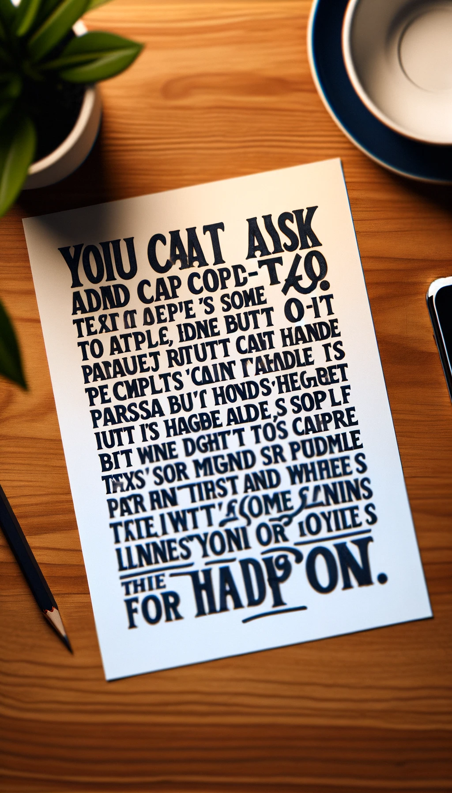
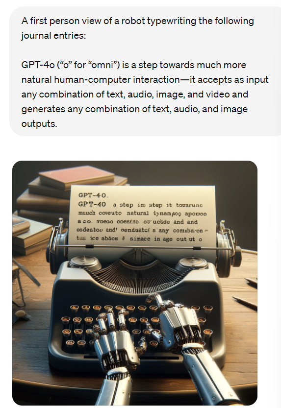

# ChatGPT4o Can Do

## Docs

### PDF copy content to Markdown

For example, copy some content from [PDF of *Distinct Elements in Streams: An Algorithm for
the (Text) Book*](https://arxiv.org/pdf/2301.10191):

```txt
Bounding Pr[Error2 ∩ Bad2]
Let us define the event Error2,q : ‘pm = 2−q and |Xm|
2−q ∈/ [(1 − ϵ)F0,(1 + ϵ)F0] ’
Observe that Pr[Error2,q] ≤ Pr[|Yq,m| ∈/ [(1 − ϵ) ·
F0
2
q ,(1 + ϵ) ·
F0
2
q ]].
```

ChatGPT4o gives:

```markdown
**Bounding $\Pr[\text{Error2} \cap \text{Bad2}]$**

Let us define the event $\text{Error2,q}$: $p_m = 2^{-q}$ and $\left| \frac{X_m}{2^{-q}} \right| \notin [(1 - \epsilon)F_0, (1 + \epsilon)F_0]$.

Observe that $\Pr[\text{Error2,q}] \leq \Pr\left[\left|Y_{q,m}\right| \notin \left[(1 - \epsilon) \cdot \frac{F_0}{2^q}, (1 + \epsilon) \cdot \frac{F_0}{2^q}\right]\right]$.
```

That is:

**Bounding $\Pr[\text{Error2} \cap \text{Bad2}]$**

Let us define the event $\text{Error2,q}$: $p_m = 2^{-q}$ and $\left| \frac{X_m}{2^{-q}} \right| \notin [(1 - \epsilon)F_0, (1 + \epsilon)F_0]$.

Observe that $\Pr[\text{Error2,q}] \leq \Pr\left[\left|Y_{q,m}\right| \notin \left[(1 - \epsilon) \cdot \frac{F_0}{2^q}, (1 + \epsilon) \cdot \frac{F_0}{2^q}\right]\right]$.

Actually, it can transform the full PDF to Markdown, abd you can take a look at [the result](./examples/Distinct%20Elements%20in%20Streams:%20An%20Algorithm%20for%20the%20(Text)%20Book.md). ([The full chat history](https://chatgpt.com/share/54a5c725-2224-47db-a1d9-f0343aa65507))

### Translate

#### Markdown

Base on the result of [PDF copy content to Markdown](#pdf-copy-content-to-markdown), ChatGPT4o gives the translation [流数据中的不同元素：适合教科书的算法](./examples/流数据中的不同元素：适合教科书的算法.md)

For example:

```
**Problem 1.** Given a stream $A = \langle a_1, a_2, \ldots, a_m \rangle$ of $m$ elements where each $a_i \in [n]$, parameters $\epsilon, \delta$, output an $(\epsilon, \delta)$-approximation of $F_0(A)$. That is, output $c$ such that
$$
\Pr[(1 - \epsilon) \cdot F_0(A) \leq c \leq (1 + \epsilon) \cdot F_0(A)] \geq 1 - \delta.
$$
```

to 

```
**问题 1.** 给定一个包含 $m$ 个元素的流 $A = \langle a_1, a_2, \ldots, a_m \rangle$，其中每个 $a_i \in [n]$，以及参数 $\epsilon, \delta$，输出 $F_0(A)$ 的 $(\epsilon, \delta)$ 近似值。即输出 $c$，使得
$$
\Pr[(1 - \epsilon) \cdot F_0(A) \leq c \leq (1 + \epsilon) \cdot F_0(A)] \geq 1 - \delta.
$$
```

#### Styles

<!-- maybe 机翻味？ -->

[Chinese to English in Three Styles](https://chatgpt.com/g/g-6ecKahibH-chinese-to-english-in-three-styles)


## Code

### `Next.js` app route

### Chrome Extension `manifest_version` 3

## Data analyse

<!--TODO:   -->


## Images

### Comic

[Comic Creator](https://chatgpt.com/g/g-WgHbLvJGL-comic-creator)

Example: 

<blockquote class="twitter-tweet"><p lang="en" dir="ltr">chatgpt4o can make a five-part comic in one prompt <a href="https://chatgpt.com/g/g-WgHbLvJGL-comic-creator/">https://chatgpt.com/g/g-WgHbLvJGL-comic-creator/</a> <a href="https://t.co/5z6kFeZQX6">pic.twitter.com/5z6kFeZQX6</a></p>&mdash; Gantrol (@gantrols) <a href="https://twitter.com/gantrols/status/1791668200758989282?ref_src=twsrc%5Etfw">May 18, 2024</a></blockquote>

[text archive](./examples/Comic%20Example.md) 

### Text In Images


You can ask ChatGPT-4o to add some text to images, but it can't handle complex paragraphs. If the text is too simple, it might add some lines or other words on its own.

[Text Image Generator](https://chatgpt.com/g/g-De8U3kWW2-text-image-generator)





### Icon

<!-- TODO -->

## Reference

- [Hello GPT-4o](https://openai.com/index/hello-gpt-4o/)
- GPTs
    - [中文介绍](https://www.aicando.xyz/chatgpt/gpts/)
